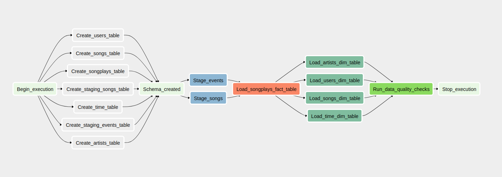

# airflow-data-pipeline

## Introduction

A music streaming company, Sparkify, has decided that it is time to introduce more automation and monitoring to their data warehouse ETL pipelines and come to the conclusion that the best tool to achieve this is Apache Airflow.

The source data resides in S3 and needs to be processed in Sparkify's data warehouse in Amazon Redshift. The source datasets consist of JSON logs that tell about user activity in the application and JSON metadata about the songs the users listen to.



## Getting started


### Project structure explanation
```
airflow-data-pipeline
│   README.md                    # Project description
│   docker-compose.yml           # Airflow containers description   
│   requirements.txt             # Python dependencies
|   dag.png                      # Pipeline DAG image
│   
└───airflow                      # Airflow home
|   |               
│   └───dags                     # Jupyter notebooks
│   |   │ s3_to_redshift_dag.py  # DAG definition
|   |   |
|   └───plugins
│       │  
|       └───helpers
|       |   | sql_queries.py     # All sql queries needed
|       |
|       └───operators
|       |   | data_quality.py    # DataQualityOperator
|       |   | load_dimension.py  # LoadDimensionOperator
|       |   | load_fact.py       # LoadFactOperator
|       |   | stage_redshift.py  # StageToRedshiftOperator
```

#### Requirements

* Install [Python3](https://www.python.org/downloads/)
* Install [Docker](https://www.docker.com/)
* Install [Docker Compose](https://docs.docker.com/compose/install/)
* [AWS](https://aws.amazon.com/) account and [Redshift](https://aws.amazon.com/redshift/) cluster 

#### Clone repository to local machine
```
git clone https://github.com/brfulu/airflow-data-pipeline.git
```

#### Change directory to local repository
```
cd airflow-data-pipeline
```

#### Create python virtual environment
```
python3 -m venv venv             # create virtualenv
source venv/bin/activate         # activate virtualenv
pip install -r requirements.txt  # install requirements
```

#### Start Airflow container
Everything is configured in the docker-compose.yml file.
If you are satisfied with the default configurations you can just start the containers.
```
docker-compose up
```

#### Visit the Airflow UI
Go to http://localhost:8080

Username: user 

Password: password

#### Connect Airflow to AWS

1. Click on the Admin tab and select Connections.


2. Under Connections, select Create.

3. On the create connection page, enter the following values:
- Conn Id: Enter aws_credentials.
- Conn Type: Enter Amazon Web Services.
- Login: Enter your Access key ID from the IAM User credentials.
- Password: Enter your Secret access key from the IAM User credentials.

Once you've entered these values, select Save and Add Another.

4. On the next create connection page, enter the following values:
- Conn Id: Enter redshift.
- Conn Type: Enter Postgres.
- Host: Enter the endpoint of your Redshift cluster, excluding the port at the end.
- Schema: Enter dev. This is the Redshift database you want to connect to.
- Login: Enter awsuser.
- Password: Enter the password you created when launching your Redshift cluster.
- Port: Enter 5439.

Once you've entered these values, select Save.

#### Start the DAG
Start the DAG by switching it state from OFF to ON.

Refresh the page and click on the s3_to_redshift_dag to view the current state.

The whole pipeline should take around 10 minutes to complete.


## Project

### Requirements
- Create Redshift cluster in AWS
- Create the tables in the databese using: create_tables.py
- Open the Airflow UI and add your connection details (aws_credentials,
  redshift)

### Pipeline execution

The following task will be executed:
- Load data from S3 to Redshift (stage_events_to_redshift,
  stage_songs_to_redshift)
- Load data from staging tables to fact table (load_songplays_table)
- Load data from fact table to dimension tables (load_song_dimension_table,
  load_user_dimension_table, load_artist_dimension_table,
  load_time_dimension_table,)
- Execute a task to check quality of data (run_quality_checks)


# Execution

1. Create Amazon Redshift database.

2. Run `create_tables.sql` to create the tables.

3. Run `etl_task.py` to process the entire datasets.

